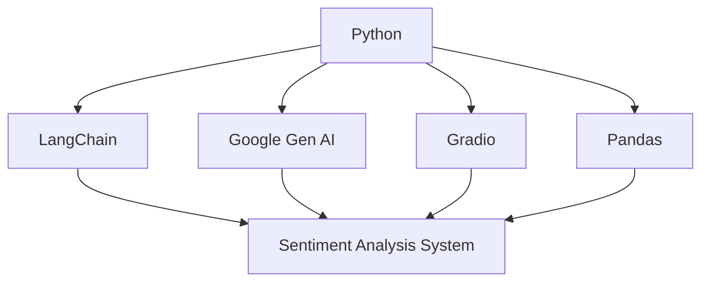

# Aspect-Based Sentiment Analysis System

[](https://www.python.org/)
[](https://python.langchain.com/docs/get_started/introduction.html)
[](https://cloud.google.com/natural-language)
[](https://gradio.app/)

## Overview
A sophisticated sentiment analysis tool that goes beyond basic positive/negative classification to provide detailed, aspect-level sentiment analysis of product reviews. Using advanced LLM capabilities through Google's Generative AI and LangChain, this system analyzes customer reviews to extract specific product aspects, their associated sentiments, and provides actionable insights for product improvement.

## 🌟 Key Features
- **Granular Sentiment Analysis**: Analyzes sentiments for specific aspects/features of products
- **Automated Insight Generation**: Creates three downloadable output files:
  1. `analyzed_product.csv`: Detailed aspect-wise sentiment breakdown
  2. `aspect_summary.csv`: Top positive and negative aspects identified
  3. `improvement_suggestions.csv`: AI-generated actionable recommendations
- **User-Friendly Interface**: Simple upload-and-analyze workflow using Gradio
- **Batch Processing**: Handle multiple reviews simultaneously through CSV upload
- **Downloadable Reports**: All analyses available in easy-to-use CSV format

## 🛠️ Tech Stack


## 🚀 Getting Started

### Prerequisites
```bash
pip install -r requirements.txt
```

### Setup
1. Clone the repository
```bash
git clone https://github.com/yourusername/aspect-based-sentiment-analysis.git
cd aspect-based-sentiment-analysis
```

2. Set up your Google API credentials
```bash
export GOOGLE_API_KEY='your_api_key_here'
```

3. Run the application
```bash
python app.py
```

## 💡 Why This Application?

### Business Value
- **Deep Insights**: Uncover specific product aspects that drive customer satisfaction or dissatisfaction
- **Actionable Feedback**: Get concrete suggestions for product improvements
- **Time Efficiency**: Analyze thousands of reviews in minutes
- **Data-Driven Decisions**: Make informed product development choices based on customer feedback
- **Competitive Edge**: Understand product strengths and weaknesses at a granular level

### Use Cases
```plaintext
Product Development Teams ──► Feature Prioritization
Customer Service       ──► Pain Point Identification
Marketing Teams       ──► Strength Highlighting
Business Strategy     ──► Trend Analysis
```

## 📝 Input Format
Your CSV file should contain a column named 'reviews.text' with customer reviews:
```csv
reviews.text
"The battery life is amazing but the screen could be brighter"
"Love the camera quality, although the app crashes sometimes"
```

## 📈 Output Format

### 1. analyzed_product.csv
```csv
aspect,sentiment_score,context,review_source
battery_life,0.9,"amazing battery performance",review_id_1
screen_brightness,-0.3,"screen could be brighter",review_id_1
```

### 2. aspect_summary.csv
```csv
positive_aspect,frequency,negative_aspect,frequency
battery_life,45,screen_brightness,23
camera_quality,38,app_stability,19
```

### 3. improvement_suggestions.csv
```csv
aspect,current_issues,suggested_improvements,priority
screen_brightness,"Low brightness levels","Increase maximum brightness",HIGH
app_stability,"Random crashes","Implement better error handling",MEDIUM
```


## 📧 Contact
Your Name - [MMitesh1201](https://github.com/MMitesh1201)

Project Link: [https://github.com/MMitesh1201/Aspect-based-sentimental-analysis](https://github.com/MMitesh1201/Aspect-based-sentimental-analysis)
